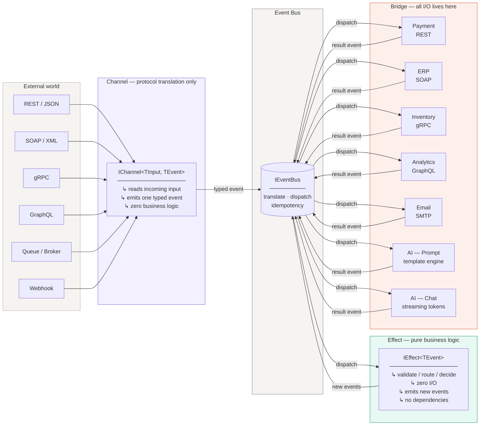

# CEB — Channel · Effect · Bridge

> A structural architectural pattern for systems with multiple integrations and AI/ML components.

---

## Overflow



## English

### Overview

CEB is an architectural pattern designed to bring clarity and discipline to systems that integrate with many external services simultaneously — REST APIs, SOAP services, gRPC, GraphQL, message queues, and AI language models. It organizes the system into three distinct layers, each with a strict and non-negotiable responsibility.

The central premise is simple: **nothing calls anything directly**. All communication between layers flows through a typed, asynchronous event bus. This single constraint eliminates the coupling problems that make integration-heavy systems hard to maintain, test, and extend.

### The Three Layers

#### Channel — Protocol Translation

The Channel is the entry point of the system. Its sole responsibility is to receive external input in whatever protocol it arrives — an HTTP request, a SOAP envelope, a gRPC call, a GraphQL mutation, a queue message, a webhook payload — and translate it into a single typed domain event published onto the event bus.

A Channel contains no business logic. It does not validate, it does not decide, it does not transform data beyond what is necessary to construct the event. If you find conditional logic inside a Channel, that logic belongs in an Effect.

The practical consequence of this rule is significant: adding support for a new integration protocol requires adding one new Channel class. No other part of the system needs to change. A system that today receives orders via REST can tomorrow also receive them via a message queue or a legacy SOAP service — the Effects and Bridges are completely unaffected.

```
REST  ──┐
SOAP  ──┤
gRPC  ──┼──► Channel ──► [OrderReceived] ──► Event Bus
GraphQL─┤
Queue ──┘
```

#### Effect — Pure Business Logic

The Effect is where business rules live. It receives a typed event from the bus, applies deterministic logic, and emits zero or more new events back onto the bus. That is all it does.

The defining constraint of an Effect is the complete absence of I/O. An Effect never makes an HTTP call, never queries a database, never reads a file, never calls an AI model, never accesses the system clock directly, and never generates randomness. If a piece of code needs any of these things, it does not belong in an Effect.

This constraint makes Effects trivially testable. Because an Effect has no external dependencies beyond the event bus, a unit test requires no mocks, no stubs, no test containers, no network. You pass an event in and assert on the events that come out. The test is deterministic, fast, and isolated by design.

Effects are also the layer that decides when AI gets involved. An Effect may emit a `PromptRequested` event or a `ChatMessageReceived` event — but it never calls the AI model itself. That call belongs in a Bridge.

#### Bridge — Isolated I/O

The Bridge is the only layer permitted to perform I/O. It receives a typed event from the bus, calls an external system, and emits the result as a new event back onto the bus.

Every external dependency in the system lives in a Bridge: a payment gateway, an email service, an ERP system, a warehouse API, a message broker, and AI language models. Adding a new external integration requires adding one new Bridge. No other part of the system changes.

Bridges contain no business logic. If a Bridge has an `if/else` that decides what to do with a result, that logic belongs in an Effect. The Bridge calls the external system and emits what it receives — nothing more.

This isolation has a direct impact on resilience. Because all I/O is contained in Bridges, retry logic, circuit breakers, timeouts, and dead-letter handling can be applied uniformly at the bus level, without any individual Bridge needing to implement these concerns.

### AI Integration

CEB treats AI language models as first-class Bridge integrations. They are I/O — expensive, asynchronous, potentially unreliable — and they belong in the Bridge layer like any other external call. This is in contrast to architectures that treat AI as a special component with its own orchestration logic scattered through the codebase.

Two integration patterns are supported:

**Prompt Engineering with Templates**

A `PromptRequested` event carries a template name and a set of variables. The AI Bridge resolves the template, fills the variables, calls the language model, and emits a `PromptCompleted` event with the result. This pattern is equivalent to Semantic Kernel's `PromptFunction` or any template-based prompt management system. The template registry lives inside the Bridge; the rest of the system only knows about events.

**Streaming Chat**

A `ChatMessageReceived` event triggers the AI Bridge to open a streaming connection to the language model. As tokens arrive, the Bridge emits `ChatStreamChunk` events onto the bus — one per chunk, with a flag indicating the final token. Any consumer subscribed to `ChatStreamChunk` — a WebSocket handler, a SignalR hub, a server-sent events endpoint — receives each chunk in real time and pushes it to the client. The streaming I/O is fully encapsulated in the Bridge; the transport layer only reacts to events.

### Why This Works for Multi-Protocol Systems

The core insight of CEB in the context of multiple integration protocols is that **the domain model is protocol-agnostic**. An order placed via REST and an order placed via a legacy SOAP service are the same `OrderReceived` event from the perspective of everything downstream. The Channel absorbs the protocol differences so that the business logic never has to deal with them.

This means the same Effect that validates an order, and the same Bridge that charges a payment, serve all protocols simultaneously. The system scales horizontally in terms of integrations — each new protocol is an additive change, not a modification of existing code.

### Structure

```
Core/
  Abstractions.cs   IChannel<TInput,TEvent>, IEffect<TEvent>, IBridge<TEvent>, IEventBus
  EventBus.cs       In-memory async event bus
  Events.cs         All typed domain events

Channels/
  OrderChannels.cs  RestOrderChannel, SoapOrderChannel, GrpcOrderChannel,
                    GraphQlOrderChannel, QueueOrderChannel, ChatChannel

Effects/
  OrderEffects.cs   ValidateOrderEffect, RouteToPaymentEffect,
                    ConfirmAfterPaymentEffect, RoutePromptResultEffect

Bridges/
  Bridges.cs        PaymentBridge (REST), EmailBridge (SMTP),
                    ErpBridge (SOAP), InventoryBridge (gRPC),
                    AnalyticsBridge (GraphQL), AiPromptBridge, AiStreamingChatBridge

Host/
  Program.cs        Composition root — wiring and demo scenarios
```

### Running

```bash
dotnet run --project CEB.Simple.csproj
```

### Prior Art

CEB is not a claim of invention. It stands on decades of established patterns:

- **Hexagonal Architecture** (Alistair Cockburn, 2005) — Channel = primary adapter, Bridge = secondary adapter
- **Functional Core / Imperative Shell** (Gary Bernhardt, 2012) — Effect = pure core, Bridge = imperative shell
- **Enterprise Integration Patterns** (Hohpe & Woolf, 2003) — Message Channel, Channel Adapter, Dead Letter Channel
- **Architecture Patterns with Python** (Percival & Gregory, 2020) — message bus as the central spine

What CEB contributes is a single opinionated triad with clear naming, strict I/O rules enforced by convention, and explicit first-class treatment of AI/ML models as ordinary Bridge integrations — a concern that none of the original pattern literature addresses.

---

## Português

### Visão Geral

CEB é um padrão arquitetural criado para trazer clareza e disciplina a sistemas que se integram com muitos serviços externos ao mesmo tempo — APIs REST, serviços SOAP, gRPC, GraphQL, filas de mensagens e modelos de linguagem com inteligência artificial. Ele organiza o sistema em três camadas distintas, cada uma com uma responsabilidade estrita e inegociável.

A premissa central é simples: **nada chama nada diretamente**. Toda a comunicação entre camadas flui por um barramento de eventos tipado e assíncrono. Essa única restrição elimina os problemas de acoplamento que tornam sistemas com muitas integrações difíceis de manter, testar e evoluir.

### As Três Camadas

#### Channel — Tradução de Protocolo

O Channel é o ponto de entrada do sistema. Sua única responsabilidade é receber a entrada externa em qualquer protocolo que ela chegue — uma requisição HTTP, um envelope SOAP, uma chamada gRPC, uma mutation GraphQL, uma mensagem de fila, um payload de webhook — e traduzi-la em um único evento de domínio tipado, publicado no barramento de eventos.

Um Channel não contém lógica de negócio. Ele não valida, não decide, não transforma dados além do necessário para construir o evento. Se você encontrar lógica condicional dentro de um Channel, essa lógica pertence a um Effect.

A consequência prática dessa regra é significativa: adicionar suporte a um novo protocolo de integração exige apenas uma nova classe Channel. Nenhuma outra parte do sistema precisa mudar. Um sistema que hoje recebe pedidos via REST pode amanhã também recebê-los via fila de mensagens ou um serviço SOAP legado — os Effects e Bridges não são afetados de forma alguma.

```
REST   ──┐
SOAP   ──┤
gRPC   ──┼──► Channel ──► [OrderReceived] ──► Barramento de Eventos
GraphQL──┤
Fila   ──┘
```

#### Effect — Lógica de Negócio Pura

O Effect é onde as regras de negócio residem. Ele recebe um evento tipado do barramento, aplica lógica determinística e emite zero ou mais novos eventos de volta ao barramento. Só isso.

A restrição que define um Effect é a ausência completa de I/O. Um Effect nunca faz uma chamada HTTP, nunca consulta um banco de dados, nunca lê um arquivo, nunca chama um modelo de IA, nunca acessa o relógio do sistema diretamente e nunca gera aleatoriedade. Se um trecho de código precisa de qualquer uma dessas coisas, ele não pertence a um Effect.

Essa restrição torna os Effects trivialmente testáveis. Como um Effect não tem dependências externas além do barramento de eventos, um teste unitário não precisa de mocks, stubs, containers de teste ou rede. Você passa um evento e verifica os eventos que saem. O teste é determinístico, rápido e isolado por design.

Os Effects também são a camada que decide quando a IA entra em cena. Um Effect pode emitir um evento `PromptRequested` ou `ChatMessageReceived` — mas nunca chama o modelo de IA diretamente. Essa chamada pertence a um Bridge.

#### Bridge — I/O Isolado

O Bridge é a única camada autorizada a realizar I/O. Ele recebe um evento tipado do barramento, chama um sistema externo e emite o resultado como um novo evento de volta ao barramento.

Toda dependência externa do sistema vive em um Bridge: um gateway de pagamento, um serviço de e-mail, um sistema ERP, uma API de estoque, um broker de mensagens e modelos de linguagem com IA. Adicionar uma nova integração externa exige apenas um novo Bridge. Nenhuma outra parte do sistema muda.

Bridges não contêm lógica de negócio. Se um Bridge tem um `if/else` que decide o que fazer com um resultado, essa lógica pertence a um Effect. O Bridge chama o sistema externo e emite o que recebe — nada mais.

Esse isolamento tem impacto direto na resiliência. Como todo I/O está contido nos Bridges, lógica de retry, circuit breakers, timeouts e tratamento de dead-letter podem ser aplicados de forma uniforme no nível do barramento, sem que cada Bridge individual precise implementar essas preocupações.

### Integração com IA

O CEB trata modelos de linguagem com IA como integrações de primeira classe na camada Bridge. Eles são I/O — caros, assíncronos, potencialmente instáveis — e pertencem à camada Bridge como qualquer outra chamada externa. Isso contrasta com arquiteturas que tratam a IA como um componente especial, com lógica de orquestração espalhada pelo código.

Dois padrões de integração são suportados:

**Prompt Engineering com Templates**

Um evento `PromptRequested` carrega o nome de um template e um conjunto de variáveis. O AI Bridge resolve o template, preenche as variáveis, chama o modelo de linguagem e emite um evento `PromptCompleted` com o resultado. Esse padrão é equivalente ao `PromptFunction` do Semantic Kernel ou a qualquer sistema de gerenciamento de prompts baseado em templates. O registro de templates vive dentro do Bridge; o restante do sistema conhece apenas eventos.

**Chat com Streaming**

Um evento `ChatMessageReceived` aciona o AI Bridge para abrir uma conexão de streaming com o modelo de linguagem. À medida que os tokens chegam, o Bridge emite eventos `ChatStreamChunk` no barramento — um por chunk, com uma flag indicando o token final. Qualquer consumidor inscrito em `ChatStreamChunk` — um handler WebSocket, um hub SignalR, um endpoint server-sent events — recebe cada chunk em tempo real e o envia ao cliente. O I/O de streaming está completamente encapsulado no Bridge; a camada de transporte apenas reage a eventos.

### Por Que Funciona para Sistemas Multi-Protocolo

A percepção central do CEB no contexto de múltiplos protocolos de integração é que **o modelo de domínio é agnóstico ao protocolo**. Um pedido feito via REST e um pedido feito via um serviço SOAP legado são o mesmo evento `OrderReceived` do ponto de vista de tudo que vem depois. O Channel absorve as diferenças de protocolo para que a lógica de negócio nunca precise lidar com elas.

Isso significa que o mesmo Effect que valida um pedido, e o mesmo Bridge que processa o pagamento, atendem todos os protocolos simultaneamente. O sistema escala horizontalmente em termos de integrações — cada novo protocolo é uma adição, não uma modificação do código existente.

### Estrutura

```
Core/
  Abstractions.cs   IChannel<TInput,TEvent>, IEffect<TEvent>, IBridge<TEvent>, IEventBus
  EventBus.cs       Barramento de eventos assíncrono em memória
  Events.cs         Todos os eventos de domínio tipados

Channels/
  OrderChannels.cs  RestOrderChannel, SoapOrderChannel, GrpcOrderChannel,
                    GraphQlOrderChannel, QueueOrderChannel, ChatChannel

Effects/
  OrderEffects.cs   ValidateOrderEffect, RouteToPaymentEffect,
                    ConfirmAfterPaymentEffect, RoutePromptResultEffect

Bridges/
  Bridges.cs        PaymentBridge (REST), EmailBridge (SMTP),
                    ErpBridge (SOAP), InventoryBridge (gRPC),
                    AnalyticsBridge (GraphQL), AiPromptBridge, AiStreamingChatBridge

Host/
  Program.cs        Raiz de composição — configuração e cenários de demonstração
```

### Executando

```bash
dotnet run --project CEB.Simple.csproj
```

### Trabalhos Relacionados

O CEB não reivindica a invenção de nada. Ele se apoia em décadas de padrões estabelecidos:

- **Hexagonal Architecture** (Alistair Cockburn, 2005) — Channel = adaptador primário, Bridge = adaptador secundário
- **Functional Core / Imperative Shell** (Gary Bernhardt, 2012) — Effect = núcleo puro, Bridge = shell imperativo
- **Enterprise Integration Patterns** (Hohpe & Woolf, 2003) — Message Channel, Channel Adapter, Dead Letter Channel
- **Architecture Patterns with Python** (Percival & Gregory, 2020) — barramento de mensagens como espinha central

O que o CEB contribui é uma tríade opinativa com nomenclatura clara, regras estritas de I/O aplicadas por convenção e tratamento explícito de modelos de IA/ML como integrações comuns na camada Bridge — uma preocupação que nenhuma das literaturas originais de padrões aborda diretamente.
